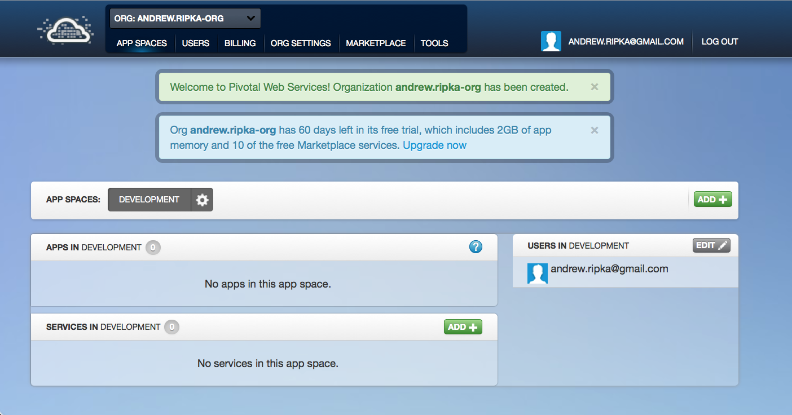

#Pivotal CF Workshop - Lab Instructions

##Module 1

###Goals
* Log on to Pivotal CF account for first time
* Setup organization
* Lab VM Setup

###Steps
1. If you have not already done so open the email from Pivotal Web Services and click the verify you address link.

   

2. Set password and select org name and click create.

   

3. Your Account should now be setup

   

4. Logon to either the Amazon AMI instance assigned to you, or the local Linux VM you have on your local machine.
  

