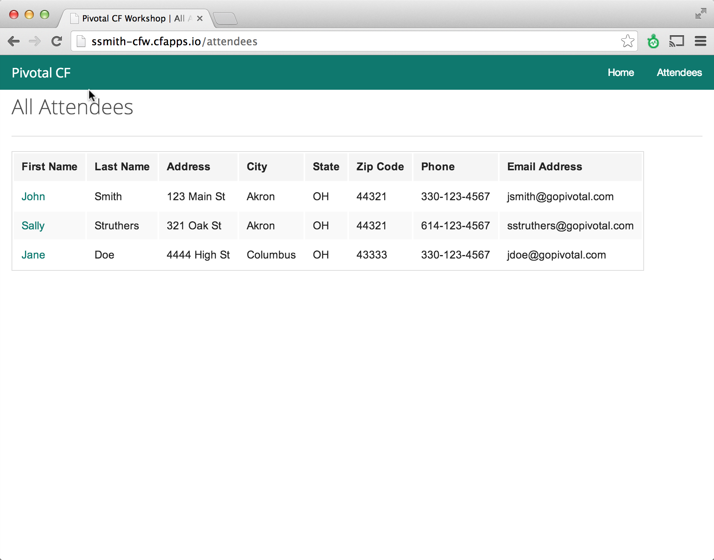

#Pivotal CF Workshop - Lab Instructions

##Java Module 4B 

###Goals
* Deploy application without service
Ÿ* Create service
Ÿ* Bind service
* Start application and use service

###Steps
1. Get information about deployed app using CLI command

	```
	> cf apps
	```


	If the sample application is not deployed complete the steps in Java Lab 4A to do so.
	Note the deployed application name.

2. Use the CI to create a new database service.

	```
	> cf create-service
	```

	When prompted:

	Choose the “elephantsql” as the service

	Name the Service “CFW-psql”
	
	Select the “turtle” plan

3. Verify the service was created

	```
	> cf services
	```

	You should see the service you just created listed.  It should not be bound to any applications.

4. Bind the service to the deployed application

	```
	> cf bind-service CFW-psql <<app_name>>
	```
	\<\<app_name>> will be the application name returned in step one.
	

5. Verify the service has been bound to your application.

	```
	> cf services
	```

	You should now see the service created in step 3 listed.  The bound application command should show your application.

6. Restart the application to utilize the service.

	```
	> cf restart <<app_name>>
	```

	You will notice the application Droplet is rebuilt

7. After application restarts open a browser and navigate to the application.  The path to the application is supplied in a message similar to the following:

	```
	Push successful! App 'ssmith-CFW' available at ssmith-CFW.cfapps.io
	```

	 

	Notice the details environment variables including the details of the bound service.

8. Click the “Attendees” Link 

	 

	You will see the attendees page with populated values.

	
	 


