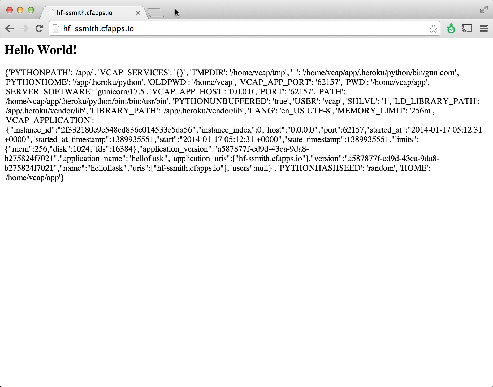

#Pivotal CF Workshop - Lab Instructions

##Module 7 

###Goals
* Deploy application using a custom external buildpack

###Steps
1. Clone the sample Helloflask Python application: 

	```
	> git clone https://github.com/ruthea/helloflask.git
	```

2. Switch to the helloflask app project folder
 
	Review manifest.yml.  Notice the buildpack directive uses an external Python buildpack from Heroku.

	```
	applications:
	- name: helloflask
  	  buildpack: git://github.com/ephoning/heroku-buildpack-python.git
	  memory: 256M
	  instances: 1
	  host: helloflask-${random-word}
	  domain: cfapps.io
	  path: .
	```

	Change host to be: hf-\<\<first_inital>>\<\<last_name>> (replace \<\<first_initial>>\<\<last_name>> with your first inital and last name e.g “hf-ssmith”)

4. Deploy helloflask application to your cloud foundry instance using cf push

	```
	> cf push
	```
	(Note - if you do not specify a manifest file manifest.yml will be used if it exists.

5. Load running application instance - open a browser and navigate to http://hf-\<\<first_inital>>\<\<last_name>>.cfapps.io (replace \<\<first_initial>>\<\<last_name>> with your first inital and last name e.g “hf-ssmith”)
  
	 


